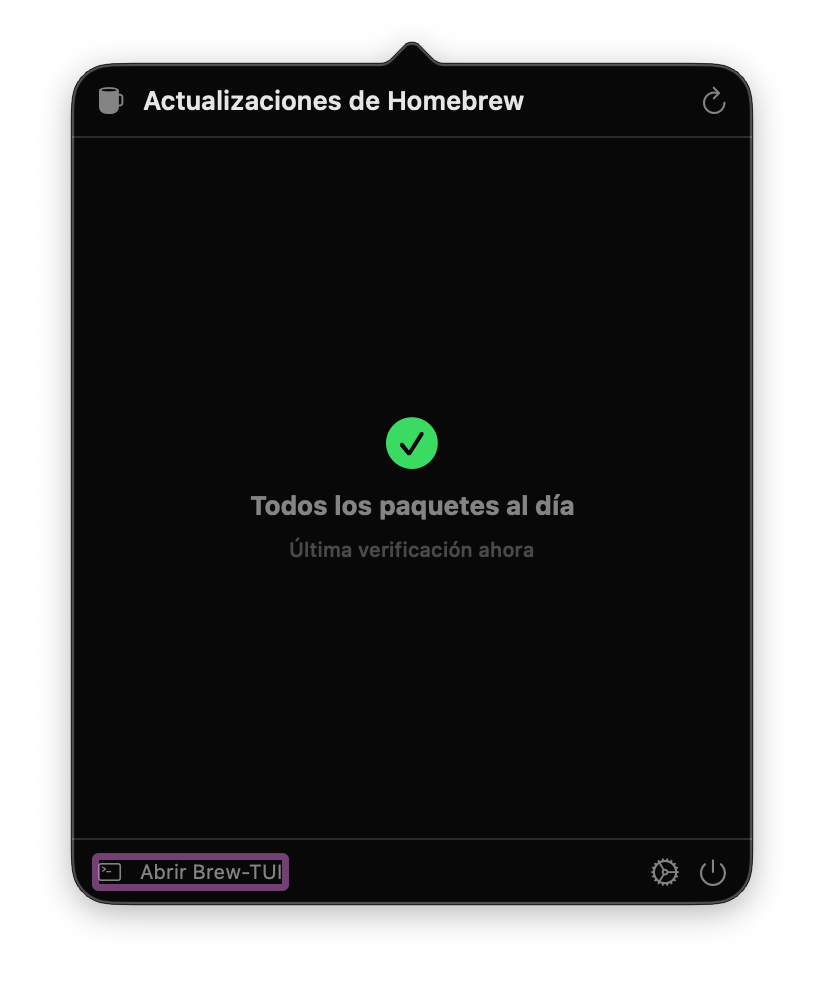

# Brew-TUI

### Your Homebrew, finally visible.

[](https://www.npmjs.com/package/brew-tui)
[](https://nodejs.org/)
[](LICENSE)
[](https://github.com/MoLinesGitHub/homebrew-tap)
[]()

A keyboard-driven terminal UI for Homebrew, with a native macOS menu bar companion that watches updates in the background. No daemons, no middleware — both tools call `brew` directly.


```bash
npm install -g brew-tui    # then just type:  brew-tui
```

---

## Why Brew-TUI?

You don't memorize `brew outdated && brew upgrade && brew services list && brew leaves`. You forget half of them. Brew-TUI puts every command behind one keystroke and shows you what `brew` never tells you until something breaks: orphans, vulnerabilities, services that died last Tuesday.

| Without Brew-TUI | With Brew-TUI |
|---|---|
| `brew outdated` → wall of text → grep | View **4** → list with version arrows → `Enter` to upgrade |
| `brew services list` → restart by hand | View **6** → toggle with one key |
| Vulnerable packages? | View **0** → cross-checked against [OSV.dev](https://osv.dev) (Pro) |
| Forgot to update? | **BrewBar** lives in your menu bar and tells you (Pro) |

---

## Install

```bash
# npm (recommended)
npm install -g brew-tui

# Homebrew
brew tap MoLinesGitHub/tap
brew install brew-tui

# Run without installing
npx brew-tui
```

**Requirements:** Node.js >= 22, Homebrew, macOS

---

## Features

| Feature | Description |
|---------|-------------|
| **Dashboard** | Overview of installed packages, outdated counts, services, and system info |
| **Installed** | Browse and filter formulae and casks with version info and status badges |
| **Search** | Find and install packages directly from the TUI |
| **Outdated** | Version comparison arrows, upgrade individually or all at once |
| **Services** | Start, stop, and restart Homebrew services |
| **Doctor** | Run `brew doctor` and see warnings at a glance |
| **Package Info** | Detailed view with dependencies, caveats, and quick actions |

### Pro Features — $19 once, lifetime

| Feature | What it solves |
|---------|----------------|
| **Profiles** | Replicate your exact setup on a new Mac in one command |
| **Smart Cleanup** | Reclaim gigabytes by listing orphans ranked by size |
| **Action History** | "What did I install last week?" — answered |
| **Security Audit** | Get notified when [OSV.dev](https://osv.dev) flags something you have installed |
| **BrewBar** | A menu bar app that watches your packages while you sleep — auto-installs and auto-launches the moment you go Pro |

> Pro is one-time payment, lifetime updates, machine-bound. No subscription. [Activate →](https://molinesdesigns.com/brewtui/pro)

---

## Screenshots

| Dashboard | Outdated | Smart Cleanup |
|---|---|---|
|  |  |  |

| Security Audit | Services | BrewBar |
|---|---|---|
|  |  |  |

---

## Usage

```bash
brew-tui                   # Launch the TUI
brew-tui status            # Show license status
brew-tui activate <key>    # Activate Pro license
brew-tui revalidate        # Revalidate Pro license
brew-tui deactivate        # Deactivate license on this machine
brew-tui delete-account    # Remove all local data (~/.brew-tui/)
```

### Keyboard Navigation

| Key | Action |
|-----|--------|
| `1`-`0` | Jump to view |
| `Tab` / `Shift+Tab` | Cycle views |
| `j` / `k` | Navigate lists |
| `Enter` | Select / confirm |
| `/` | Search / filter |
| `Escape` | Go back |
| `L` | Toggle language (en/es) |
| `q` | Quit |

### Language

Brew-TUI supports **English** and **Spanish**. Language is detected from your system locale (`LANG`), or you can:

- Pass `--lang=es` or `--lang=en` as a CLI flag
- Press `L` inside the TUI to toggle

---

## BrewBar (Pro)

BrewBar is a native macOS menu bar companion app (Swift 6 / SwiftUI) that:

- Shows a badge with outdated package count
- Sends push notifications when updates are available
- Lets you upgrade packages without opening a terminal
- Displays Homebrew service status
- Configurable check interval (1h / 4h / 8h)
- Supports Launch at Login

### Install BrewBar

```bash
# Via Brew-TUI CLI (Pro license required)
brew-tui install-brewbar
brew-tui install-brewbar --force   # Reinstall / update
brew-tui uninstall-brewbar         # Remove

# Via Homebrew Cask
brew install --cask MoLinesGitHub/tap/brewbar
```

### Build from Source

```bash
cd menubar
tuist generate
xcodebuild -workspace BrewBar.xcworkspace -scheme BrewBar build
```

Requires [Tuist](https://tuist.io), Xcode, and macOS 14+.

---

## Architecture

```
Views (React/Ink) --> Stores (Zustand) --> brew-api --> Parsers --> brew CLI (spawn)
```

| Layer | Tech | Role |
|-------|------|------|
| **UI** | React 18 + Ink 5 | Terminal rendering via ANSI escape codes |
| **State** | Zustand 5 | Global stores with per-key loading/error maps |
| **API** | brew-api.ts | Typed wrapper over `brew` CLI with input validation |
| **Parsers** | json-parser / text-parser | Parse `brew info --json`, `brew search`, `brew doctor` |
| **CLI** | brew-cli.ts | `execBrew()` (30s timeout) and `streamBrew()` (async generator, 5min idle timeout) |

- ESM-only, TypeScript strict mode, built with [tsup](https://github.com/egoist/tsup)
- All streaming operations (install, upgrade) use AsyncGenerators yielding lines in real time
- Package names validated via regex before passing to `spawn` (no shell injection)
- 99 tests across 10 suites (Vitest)

---

## Security

- License data encrypted with AES-256-GCM, machine-bound via UUID
- SHA-256 verification on BrewBar binary downloads
- Bundle integrity check at startup (fail-closed)
- Runtime validation of all external API responses (Polar, OSV)
- Rate limiting on license activation (5 attempts / 15min lockout)
- No secrets in logs, no PII transmitted without consent

---

## Project Structure

```
src/
  views/           # 12 React/Ink views
  stores/          # Zustand stores (brew, navigation, license, modal)
  components/      # Shared UI (StatusBadge, ResultBanner, SelectableRow, ...)
  hooks/           # useKeyboard, useBrewStream, useDebounce
  lib/
    license/       # Polar API, AES encryption, anti-tamper, canary
    security/      # OSV vulnerability scanning
    profiles/      # Profile export/import (Pro)
    cleanup/       # Orphan detection (Pro)
    history/       # Action logging (Pro)
    parsers/       # JSON and text parsers for brew output
  i18n/            # English + Spanish translations
  utils/           # Colors, spacing, logger, formatting
menubar/           # BrewBar (Swift 6 / SwiftUI / Tuist)
```

---

## Contributing

```bash
git clone https://github.com/MoLinesGitHub/Brew-TUI.git
cd Brew-TUI
npm install
npm run dev          # Run with tsx (requires interactive TTY)
npm run typecheck    # tsc --noEmit
npm run test         # vitest (99 tests)
npm run lint         # eslint
npm run build        # Production bundle via tsup
```

---

## License

[MIT](LICENSE) -- [MoLines Designs](https://molinesdesigns.com)
